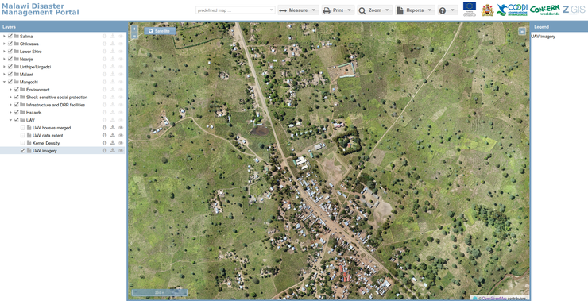

# Malawi Atlas

This repository contains the code for the _Malawi Atlas_ web application and the GeoServer styles.



## How to run:

- Clone the repository. the switch `--recurse-submodules` also downloads the [GeoExt3](https://github.com/geoext/geoext3) library as a git submodule.

  ```shell
  git clone --recurse-submodules https://github.com/ZGIS/malawi_atlas_public.git
  ```

- (if you forgot the `--recurse-submodules` flag, you can download the submodule like this):

  ```shell
  git submodule update --init --recursive
  ```

- navigate to the `webapp` directory:

  ```shell
  cd webapp
  ```

- Download the [Sencha CMD](https://www.sencha.com/products/extjs/cmd-download/) commandline tool
- Download Sencha Ext JS `6.2.0` from [here](https://www.sencha.com/legal/GPL/). Then run:

  ```shell
  sencha app install --framework=C:/sencha/sdks/ext-6.2.0

  # for development
  sencha app watch

  # for building the website
  sencha app build
  ```

Tested with Sencha Cmd v6.6 and Ext JS 6.2 (GPL).

## Code Fomatting

The code of the website is formatted using the default settings of [Prettier](https://prettier.io). See `Makefile` for the exact settings.

## Code Conventions

The `xtype` attribute for own components shall start with `ma` which stand for "Malawi Atlas". This makes sure that there is no confusion with already existing `xtype`s.

## Notes

The directory `notes` contains documentation and experiences.

## Vector Images

The directory `vector_images` contains the original graphic files that can be used to create PNG files.

## Sphinx Documenation

The folder `docs` contains the documentation which uses [Sphinx](http://www.sphinx-doc.org/en/master/) generator. Installation on Ubuntu 18.04:

```shell
# install sphinx
pip3 install -U Sphinx

# install rtd theme
pip3 install sphinx_rtd_theme
```

Build HTML

```
# html
make html
```

For creating PDFs it is necessary to un-comment the `latex_elements` settings:

```
# install rinoh PDF builder
pip3 install rinohtype

# build
sphinx-build -b rinoh . _build/rinoh
```

## Getting Started with Ext JS and OpenLayers

This command creates a new Ext JS application with classic mode only:

```
sencha \
    -sdk /PATH/TO/EXT/ext-6.2.0 \
    generate app -ext -classic \
    MalawiAtlas .
```

These links contain the documentation for the required libraries, components:

- [OpenLayers 4.6.5](https://openlayers.org/en/v4.6.5/apidoc/ol.proj.html)
- [OpenLayers 4.6.5 examples](http://openlayers.org/en/v4.6.5/examples/)
- [GeoExt 3.1](https://geoext.github.io/geoext3/v3.1.0/docs/)
- [Ext JS 6.2](https://docs.sencha.com/extjs/6.2.0/)
- [Ext JS 6.2 examples "Kitchen Sink"](http://examples.sencha.com/extjs/6.2.0/examples/kitchensink/)
